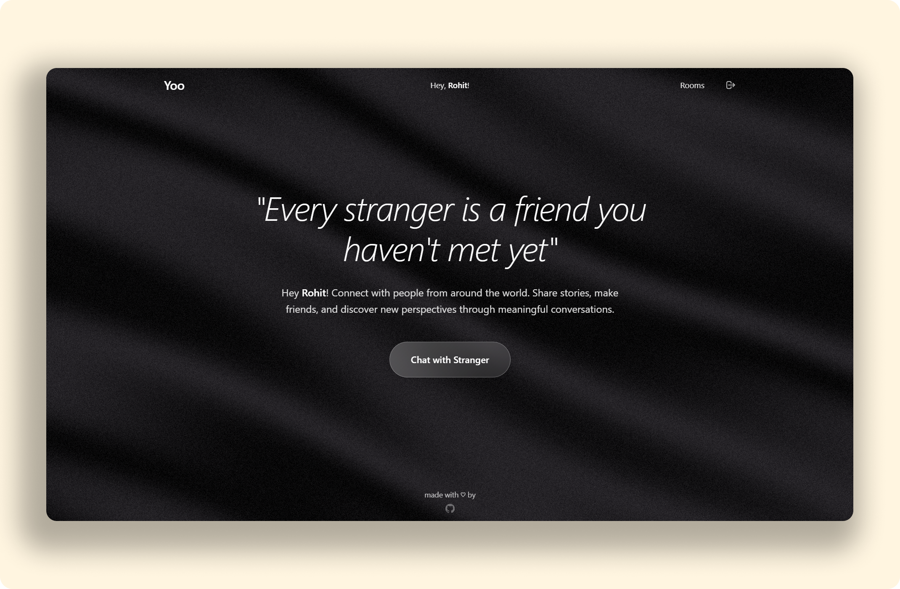

# Yoo - Socket Chat App

A real-time chat application built with React, Tailwind CSS, Node.js, Express, and Socket.IO. Users can create or join chat rooms by entering a room ID or connect with a random stranger for one-on-one chats.

## Features

- Create or join chat rooms with a unique room ID
- Real-time messaging in rooms with multiple users
- Random stranger chat feature for one-on-one conversations
- Display of connected users in each room
- Responsive UI with Tailwind CSS styling
- No login required; anonymous username-based access

## Tech Stack

**Frontend:**
- React (^19.1.0) for building the user interface
- Tailwind CSS (^4.1.10) for styling
- Socket.IO Client (^4.8.1) for real-time communication
- Vite for development and build tooling

**Backend:**
- Node.js for server-side logic
- Express (^4.21.2) for serving the application
- Socket.IO (^4.8.1) for real-time WebSocket communication

## Setup Instructions

1. Clone the repository to your local machine
2. Navigate to the project directory: `cd Yoo`
3. Install dependencies: `pnpm install`
4. **Set up environment variables:**
   - Copy `.env.example` to `.env` and customize values for frontend
   - Copy `server/.env.example` to `server/.env` and customize values for server
5. Build the React app: `pnpm run build`
6. Start the server: `pnpm start`
7. Access the app at `http://localhost:3000` in your browser

## Environment Variables

### Frontend (`.env`)
- `VITE_SERVER_URL` - Backend server URL (default: http://localhost:3000)
- `VITE_SOCKET_URL` - Socket.IO server URL (default: http://localhost:3000)
- `VITE_APP_NAME` - Application name
- `VITE_APP_VERSION` - Application version
- `VITE_MAX_MESSAGE_LENGTH` - Maximum message length (default: 500)
- `VITE_MAX_USERNAME_LENGTH` - Maximum username length (default: 20)

### Server (`server/.env`)
- `PORT` - Server port (default: 3000)
- `NODE_ENV` - Environment mode (development/production)
- `CORS_ORIGIN` - CORS allowed origins (default: *)
- `CORS_METHODS` - CORS allowed methods (default: GET,POST)
- `STATIC_PATH` - Path to static files (default: ../dist)

## Development

To run in development mode:

1. Start the backend server: `pnpm run dev:server`
2. In a new terminal, start the frontend: `pnpm run dev`
3. Frontend will be available at `http://localhost:5173`
4. Backend will be available at `http://localhost:3000`

## Usage

1. Enter a username on the start screen to begin
2. To join a room, enter a room ID and click 'Join Room'
3. To chat with a stranger, click 'Chat with Stranger' and wait for a match
4. Send messages in the chat interface; messages are broadcast to all users in the room or your stranger partner
5. Leave a room or stranger chat to return to the room selector

## Notes

- All chat data is stored in memory and will be lost when the server restarts
- Tailwind CSS is configured for styling with modern UI components
- For production, configure a domain and HTTPS for secure WebSocket connections
- Tested with Node.js v18 or higher